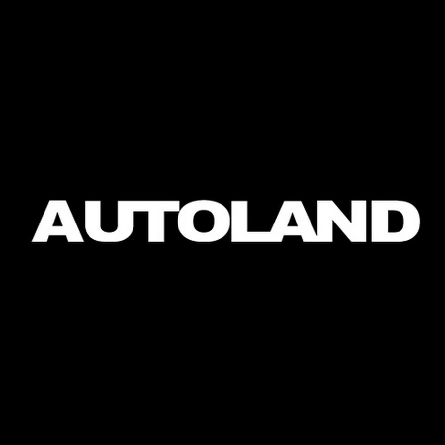
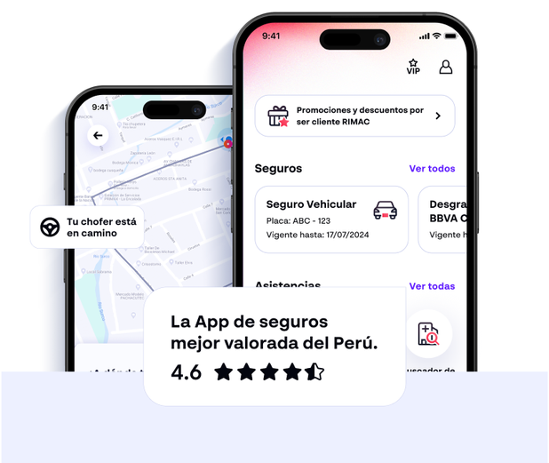
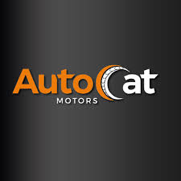

# Capítulo II: Requirements Elicitation & Analysis

## 2.1. Competidores

<table style="width: 100%; border-collapse: collapse; font-family: Arial, sans-serif;">
    <tr>
        <td colspan="5" style="border: 1px solid black; padding: 8px; vertical-align: top; "><strong>Competitive Analysis Landscape</strong></td>
    </tr>
    <tr>
        <td style="border: 1px solid black; padding: 8px; vertical-align: top;"><strong>¿Por qué llevar a cabo este análisis?</strong></td>
        <td colspan="4" style="border: 1px solid black; padding: 8px; vertical-align: top;">
            Comprender cómo se diferencia Roffies de sus principales competidores en Lima, identificar oportunidades de mejora en el mercado automotriz y validar nuestra ventaja competitiva para consolidarnos como la plataforma número uno de gestión de mantenimientos y talleres en el Perú.
        </td>
    </tr>
    <tr>
        <td style="border: 1px solid black; padding: 8px; vertical-align: top;">Marca y Logo</td>
        <td style="border: 1px solid black; padding: 8px; vertical-align: top;"><strong>Roffies</strong> </td>
        <td style="border: 1px solid black; padding: 8px; vertical-align: top;"><strong>Concesionarios oficiales</strong> </td>
        <td style="border: 1px solid black; padding: 8px; vertical-align: top;"><strong>Plataformas de Asistencia Vehicular </td>
        <td style="border: 1px solid black; padding: 8px; vertical-align: top;"><strong>Talleres Independientes </td>
    </tr>
    <tr>
        <td rowspan="2" style="border: 1px solid black; padding: 8px; vertical-align: top; width: 15%;"><strong>Perfil</strong></td>
        <td style="border: 1px solid black; padding: 8px; vertical-align: top;"><strong>Overview</strong> Plataforma digital que centraliza talleres afiliados, conecta conductores y ofrece historial de vehículo, alertas predictivas, cotizador y botón de emergencia.</td>
        <td style="border: 1px solid black; padding: 8px; vertical-align: top;">Servicios formales con repuestos originales y garantía de fábrica, orientados a clientes de marca en periodo de garantía.</td>
        <td style="border: 1px solid black; padding: 8px; vertical-align: top;">Apps de aseguradoras y servicios de grúa que atienden emergencias, pero sin integrar historial ni predicción de mantenimientos.</td>
        <td style="border: 1px solid black; padding: 8px; vertical-align: top;">Talleres locales con precios accesibles y flexibilidad, pero sin estandarización ni transparencia en costos.</td>
    </tr>
    <tr>
        <td style="border: 1px solid black; padding: 8px; vertical-align: top;"><strong>Ventaja competitiva</strong> - Historial digital unificado - Alertas predictivas - Cotizador en tiempo real - Botón SOS - Marketplace de repuestos</td>
        <td style="border: 1px solid black; padding: 8px; vertical-align: top;">- Garantía de fábrica - Repuestos originales - Confianza de marca</td>
        <td style="border: 1px solid black; padding: 8px; vertical-align: top;">- Atención 24/7 en emergencias - Red de grúas - Integración con seguros</td>
        <td style="border: 1px solid black; padding: 8px; vertical-align: top;">- Precios económicos - Flexibilidad - Cercanía geográfica</td>
    </tr>
    <tr>
        <td rowspan="2" style="border: 1px solid black; padding: 8px; vertical-align: top;"><strong>Perfil de Marketing</strong></td>
        <td style="border: 1px solid black; padding: 8px; vertical-align: top;"><strong>Mercado objetivo</strong> Conductores de autos particulares y talleres en Lima Metropolitana.</td>
        <td style="border: 1px solid black; padding: 8px; vertical-align: top;">Clientes con vehículos nuevos en garantía y usuarios que priorizan repuestos originales.</td>
        <td style="border: 1px solid black; padding: 8px; vertical-align: top;">Usuarios asegurados y conductores que enfrentan emergencias en ruta.</td>
        <td style="border: 1px solid black; padding: 8px; vertical-align: top;">Conductores que buscan precios bajos y talleres de barrio.</td>
    </tr>
    <tr>
        <td style="border: 1px solid black; padding: 8px; vertical-align: top;"><strong>Estrategias de marketing</strong> - Publicidad digital - Alianzas con aseguradoras - Estrategia inbound - Casos de éxito</td>
        <td style="border: 1px solid black; padding: 8px; vertical-align: top;">- Promociones en concesionarios - Publicidad tradicional - Alianzas con fabricantes</td>
        <td style="border: 1px solid black; padding: 8px; vertical-align: top;">- Promoción con seguros - Paquetes de asistencia - Programas de fidelización</td>
        <td style="border: 1px solid black; padding: 8px; vertical-align: top;">- Volantes - Recomendaciones - Precios bajos</td>
    </tr>
    <tr>
        <td rowspan="3" style="border: 1px solid black; padding: 8px; vertical-align: top;"><strong>Perfil de Producto</strong></td>
        <td style="border: 1px solid black; padding: 8px; vertical-align: top;"><strong>Productos & Servicios</strong> - Agenda online - Alertas predictivas - Cotizador en tiempo real - Botón SOS - Marketplace - Reputación talleres</td>
        <td style="border: 1px solid black; padding: 8px; vertical-align: top;">- Mantenimiento preventivo y correctivo - Repuestos originales - Servicios exclusivos por marca</td>
        <td style="border: 1px solid black; padding: 8px; vertical-align: top;">- Servicio de grúa 24/7 - Cambio de llantas y batería - Asistencia en carretera</td>
        <td style="border: 1px solid black; padding: 8px; vertical-align: top;">- Servicios generales - Reparaciones rápidas</td>
    </tr>
    <tr>
        <td style="border: 1px solid black; padding: 8px; vertical-align: top;"><strong>Precios & Costos</strong> Freemium + comisión + suscripción premium + margen en repuestos</td>
        <td style="border: 1px solid black; padding: 8px; vertical-align: top;">30–50% más caros que talleres independientes</td>
        <td style="border: 1px solid black; padding: 8px; vertical-align: top;">Incluido en seguros o S/30–50 mensuales</td>
        <td style="border: 1px solid black; padding: 8px; vertical-align: top;">Costos bajos y negociables</td>
    </tr>
    <tr>
        <td style="border: 1px solid black; padding: 8px; vertical-align: top;"><strong>Canales de distribución</strong> Web y app móvil</td>
        <td style="border: 1px solid black; padding: 8px; vertical-align: top;">Presencial, call center o web básica</td>
        <td style="border: 1px solid black; padding: 8px; vertical-align: top;">Apps móviles y contacto telefónico</td>
        <td style="border: 1px solid black; padding: 8px; vertical-align: top;">Atención presencial y referencias locales</td>
    </tr>
    <tr>
        <td rowspan="4" style="border: 1px solid black; padding: 8px; vertical-align: top;"><strong>Análisis SWOT</strong></td>
        <td style="border: 1px solid black; padding: 8px; vertical-align: top;"><strong>Fortalezas</strong> - Plataforma integral - Historial único - Transparencia de precios - Funciones diferenciales</td>
        <td style="border: 1px solid black; padding: 8px; vertical-align: top;">- Marca fuerte - Garantía - Infraestructura moderna</td>
        <td style="border: 1px solid black; padding: 8px; vertical-align: top;">- Cobertura nacional - Atención rápida</td>
        <td style="border: 1px solid black; padding: 8px; vertical-align: top;">- Precios bajos - Cercanía - Flexibilidad</td>
    </tr>
    <tr>
        <td style="border: 1px solid black; padding: 8px; vertical-align: top;"><strong>Debilidades</strong> - Comunidad pequeña - Dependencia de talleres - Generar confianza</td>
        <td style="border: 1px solid black; padding: 8px; vertical-align: top;">- Costos altos - Atención limitada - Baja flexibilidad</td>
        <td style="border: 1px solid black; padding: 8px; vertical-align: top;">- No abordan mantenimientos preventivos - Limitados a emergencias</td>
        <td style="border: 1px solid black; padding: 8px; vertical-align: top;">- Falta de transparencia - Escasa profesionalización - Sin historial digital</td>
    </tr>
    <tr>
        <td style="border: 1px solid black; padding: 8px; vertical-align: top;"><strong>Oportunidades</strong> - Crecimiento parque automotor - Digitalización - Alianzas con aseguradoras</td>
        <td style="border: 1px solid black; padding: 8px; vertical-align: top;">- Ventas de autos nuevos - Expansión posventa</td>
        <td style="border: 1px solid black; padding: 8px; vertical-align: top;">- Aumento de seguros vehiculares</td>
        <td style="border: 1px solid black; padding: 8px; vertical-align: top;">- Crecer si se formalizan</td>
    </tr>
    <tr>
        <td style="border: 1px solid black; padding: 8px; vertical-align: top;"><strong>Amenazas</strong> - Aparición de startups - Resistencia a formalizarse - Baja adopción tecnológica</td>
        <td style="border: 1px solid black; padding: 8px; vertical-align: top;">- Pérdida de clientes por costos - Competencia talleres independientes</td>
        <td style="border: 1px solid black; padding: 8px; vertical-align: top;">- Nuevas startups con SOS + mantenimiento - Cambios regulatorios</td>
        <td style="border: 1px solid black; padding: 8px; vertical-align: top;">- Desconfianza de usuarios - Falta de certificaciones - Competencia digital</td>
    </tr>
</table>

## 2.1.2. Estrategias y tácticas frente a competidores

En base al análisis competitivo y al SWOT previo, definimos un conjunto de estrategias y tácticas para que Roffies aproveche nuestras fortalezas, subsane nuestras debilidades, explote las oportunidades de mercado y mitigue las amenazas derivadas de la competencia.

**Afrontando las fortalezas de nuestros competidores**
**Fortalezas de los competidores**
- Concesionarios oficiales: confianza de marca, repuestos originales y servicios certificados.
- Aseguradoras y apps de asistencia: cobertura 24/7 y red de grúas nacionales.
- Talleres independientes: precios accesibles, flexibilidad y proximidad al usuario.

**Nuestras fortalezas**
- Historial digital unificado y accesible del vehículo.
- Alertas predictivas basadas en datos de fabricantes, kilometraje e historial.
- Cotizador en tiempo real con comparación entre talleres.
- Botón SOS con conexión inmediata a grúa y taller cercano.
- Marketplace de repuestos y servicios.

**Estrategias**
- Diferenciación tecnológica
Posicionar Roffies como la única plataforma que combina historial digital, predicción de averías y cotización instantánea.
- Confianza híbrida
Alianzas estratégicas con concesionarios y aseguradoras para sumar legitimidad a nuestra plataforma.
- Accesibilidad y conveniencia
Garantizar que el usuario tenga más opciones, mejores precios y atención más rápida que en cualquier competidor aislado.

**Tácticas**
- Lanzar campañas de comunicación mostrando comparativas de precios y tiempos entre Roffies vs. concesionarios.
- Crear un programa de “taller verificado” con insignias que validen calidad y confianza.
- Ofrecer descuentos exclusivos en la primera atención a través de la app.

**Afrontando las debilidades de nuestros competidores**
**Debilidades de los competidores**
- Concesionarios: costos elevados y atención limitada a una sola marca.
- Aseguradoras: servicios enfocados en emergencias, no en mantenimientos preventivos.
- Talleres independientes: falta de estandarización y poca transparencia en precios.

**Nuestras debilidades**
- Comunidad inicial pequeña y limitada adopción digital en talleres de Lima.
- Dependencia de la afiliación voluntaria de talleres.
- Necesidad de generar confianza en usuarios que tradicionalmente van a su “mecánico de confianza”.

**Estrategias**
- Programa de adopción temprana
Incentivar la afiliación de talleres con planes gratuitos iniciales y beneficios en visibilidad.
- Educación al consumidor
Campañas de concientización sobre los riesgos de no llevar historial de mantenimiento.

**Tácticas**
- Entregar un “certificado digital de mantenimiento” gratuito a los primeros talleres afiliados.
- Crear contenido educativo en redes sobre seguridad vial y mantenimiento preventivo.
- Organizar ferias o eventos presenciales de talleres afiliados para construir confianza en la marca.

**Aprovechando las oportunidades del mercado**
**Oportunidades detectadas**
- Crecimiento del parque automotor en Lima (más de 2,8 millones de vehículos).
- Baja digitalización de los talleres mecánicos, lo que abre espacio a soluciones tecnológicas.
- Tendencia global hacia la movilidad segura y los mantenimientos predictivos.

**Nuestras oportunidades**
- Posicionarnos como el primer historial digital del vehículo en Perú.
Convertirnos en puente entre aseguradoras, concesionarios y talleres independientes.

**Estrategias**
**Integración aseguradora**
Ofrecer a las compañías de seguros acceso al historial de mantenimiento para premiar a los usuarios con mejores condiciones.

**Marketplace escalable**
Incorporar venta de repuestos originales y alternativos dentro de la app.

**Expansión territorial**
Escalar el modelo desde Lima hacia provincias con alta densidad de vehículos (Arequipa, Trujillo, Piura)
**Tácticas**
- Pilotar con una aseguradora en Lima descuentos en pólizas por historial validado.
- Crear alianzas con importadores de repuestos locales.
- Publicar reportes anuales del estado del parque automotor como referencia de la industria.
  
**Mitigando las amenazas del entorno**
**Amenazas principales**
- Aparición de startups similares con mejor financiamiento.
- Resistencia cultural de talleres independientes a formalizar procesos digitales.
- Cambios regulatorios en seguros y movilidad.
  
**Nuestras amenazas**
- Baja adopción inicial de la aplicación en usuarios tradicionales.
- Dificultades para consolidar una red amplia de talleres confiables al inicio.
**Estrategias**
**Construcción de confianza**
Implementar un sello de “Roffies Garantizado” con estándares mínimos de calidad para talleres.
**Escalabilidad flexible**
Diseñar la plataforma con capacidad de adaptarse a normativas y nuevas alianzas.
**Tácticas**
- Publicar casos de éxito de talleres independientes que incrementaron clientes gracias a Roffies.
- Crear un plan de soporte técnico y capacitación digital para talleres afiliados.
- Monitorear cambios regulatorios y adaptar la plataforma a estándares internacionales de movilidad y datos.

## 2.2. Entrevistas
La sección cubre el proceso de exploración de nuestros segmentos objetivos a través de la recopilación de datos obtenidos mediante entrevistas.
### 2.2.1. Diseño de entrevistas
## Diseño de entrevista – Primer segmento objetivo: Dueños de vehículos
1. ¿Cuál es su nombre?
2. ¿Qué edad tiene?
3. ¿Qué tipo de vehículo conduce (auto, camioneta, moto, etc.)?
4. ¿Con qué frecuencia suele llevar su vehículo a mantenimiento o reparación?
5. ¿Cómo elige actualmente un taller mecánico cuando necesita servicio?
6. ¿Prefiere concesionarios oficiales o talleres independientes? ¿Por qué?
7. ¿Alguna vez ha tenido una mala experiencia con un taller? ¿Qué ocurrió?
8. ¿Qué tan importante es para usted tener un historial de mantenimientos accesible?
9. ¿Le gustaría recibir alertas predictivas de mantenimiento según kilometraje o historial?
10. ¿Cómo realiza actualmente las comparaciones de precios entre talleres?
11. En caso de una avería en ruta, ¿qué hace normalmente para resolverlo? ¿Qué valoraría más en una aplicación como Roffies: rapidez, transparencia en precios, cercanía de talleres, historial digital, o asistencia en emergencias?
12. ¿Qué lo motivaría a descargar y usar regularmente una aplicación de este tipo?

---

## Diseño de entrevista – Segundo segmento objetivo: Talleres mecánicos
1. ¿Cuál es el nombre de su taller?
2. ¿Cuántos años lleva operando?
3. ¿Qué tipo de servicios ofrecen (general, especializado en marcas, eléctrico, etc.)?
4. ¿Cómo suelen captar a sus clientes actualmente?
5. ¿Qué tan importante es para usted aparecer en plataformas digitales para atraer más clientes?
6. ¿Han tenido problemas con clientes que no regresan por falta de seguimiento?
7. ¿Qué beneficios cree que traería llevar un registro digital de mantenimientos de cada vehículo?
8. ¿Cómo manejan actualmente la cotización de servicios? ¿Se hace manual o con software especializado?
9. ¿Estarían interesados en que los clientes pudieran programar sus citas en línea?
10. ¿Qué opina de integrar alertas de mantenimiento para recordar a sus clientes que vuelvan al taller?
11. ¿Le gustaría contar con un botón SOS que traiga clientes con emergencias a su taller más cercano?
12. ¿Qué condiciones deberían cumplirse para que su taller se afilie a una plataforma como Roffies?
13. ¿Qué lo motivaría a pagar una suscripción premium que le dé más visibilidad frente a otros talleres?

### 2.2.2. Registro de entrevistas

## Entrevista para el Segmento Objetivo 1 - Dueños de vehículos:

**Entrevista N°1:**

**Entrevistado:** Sebastián De Las Casas  

**Sexo:** Masculino

**Edad:** 21 años 

**Inicio de la Entrevista:** 0:00

**Duración de la Entrevista:** 3:31

**Resumen de la Entrevista:**
Sebastián, conductor de 21 años, realiza chequeos a su vehículo de manera periódica (cada seis meses o una vez al año). Para elegir un taller, recurrió inicialmente a Google y seleccionó el primero que encontró, aunque manifiesta mayor confianza en los talleres oficiales de marca.  
No ha tenido malas experiencias previas, pero considera muy valioso conocer con claridad las acciones realizadas durante un mantenimiento. Asimismo, destaca la importancia de recibir **alertas predictivas sobre reparaciones y kilometraje**, ya que le permitirían anticiparse a problemas.  
Actualmente no compara precios ni talleres, prefiere acudir siempre al mismo establecimiento por confianza. En caso de una avería inesperada, llama directamente a un taller en el momento. Finalmente, subraya que uno de los factores que más valoraría en un servicio digital como **SmartCare** sería la **rapidez en la asistencia en emergencias**.

**Enlace:** https://youtu.be/TZH8wQTGVig

## Entrevista para el Segmento Objetivo 2 - Talleres Mecánicos:

**Entrevista N°1:**

**Entrevistado:** Giancarlo Castañeda

**Sexo:** Masculino

**Edad:** 23

**Inicio de la Entrevista:** 0:00

**Duración de la Entrevista:** 7:07

**Resumen de la Entrevista:** 
RM AUTOMOTRIZ es un taller con 8 años de experiencia que ofrece mecánica general y servicios eléctricos básicos. Actualmente capta clientes principalmente por recomendaciones, ubicación y un uso limitado de redes sociales, pero reconoce la importancia de fortalecer su presencia digital. El taller enfrenta problemas de seguimiento, ya que muchos clientes no regresan por falta de recordatorios, y aún maneja cotizaciones de forma manual. Ven con interés la implementación de herramientas como agenda en línea, alertas de mantenimiento y un botón SOS para emergencias, ya que mejorarían la organización, fidelización y captación de clientes. Para afiliarse a una plataforma como Roffies consideran clave la confianza, la visibilidad y costos razonables, y estarían dispuestos a pagar una suscripción premium siempre que garantice mayor exposición, acceso a clientes verificados y beneficios adicionales como estadísticas y recordatorios automatizados

**Enlace:** https://youtu.be/SmuCdvWBeUU

### 2.2.3. Análisis de entrevistas

**Segmento 1: Dueños de vehículos**
La entrevista con Sebastián, conductor de 21 años, evidencia un perfil de usuario que valora la confianza y transparencia en los talleres. Aunque inicialmente eligió un taller mediante Google, reconoce que su preferencia recae en talleres oficiales, ya que le transmiten mayor seguridad. Si bien no ha tenido experiencias negativas, considera fundamental que en cada mantenimiento se le explique con claridad las acciones realizadas y los repuestos utilizados. Subraya como necesidad clave la incorporación de alertas predictivas de kilometraje y reparaciones, que le permitan anticiparse a fallos y evitar gastos imprevistos. Su patrón de consumo es estable, dado que no compara precios ni cambia de taller, lo que muestra que su fidelidad está ligada a la confianza más que al costo. En casos de emergencia, recurre a la llamada directa, aunque destaca que valoraría enormemente un servicio como SmartCare por la rapidez en la asistencia en situaciones inesperadas. Esto refleja que su prioridad es un sistema que combine inmediatez, transparencia y seguridad en la atención.

**Segmento 2: Talleres mecánicos**

La entrevista con RM Automotriz revela que, pese a tener 8 años de experiencia en mecánica general y servicios eléctricos básicos, su modelo de captación de clientes sigue siendo principalmente tradicional, basado en recomendaciones, ubicación y un uso limitado de redes sociales. Esto ha generado limitaciones en fidelización, ya que muchos clientes no regresan por la falta de recordatorios y seguimiento. Además, el taller enfrenta procesos poco eficientes al seguir utilizando cotizaciones manuales, lo que repercute en tiempos muertos y poca organización. Reconocen la necesidad de digitalizarse y ven con gran interés herramientas como agenda en línea, alertas de mantenimiento y botón SOS, las cuales consideran que fortalecerían su relación con los clientes y su posicionamiento frente a la competencia. Su disposición a pagar una suscripción premium depende de que la plataforma garantice confianza, visibilidad, acceso a clientes verificados y estadísticas útiles para mejorar la gestión y fidelización de su cartera.

## 2.3. Needfinding
En esta sección se presentarán los artefactos resultantes del proceso de análisis de la información recolectada de los segmentos objetivos

### 2.3.1. User Personas

User Persona del Primer Segmento objetivo:

| **Name** | **Type** | **Age** | **Gender** | **Location** | **Vehicle** |
|----------|----------|---------|------------|--------------|-------------|
| Sebastián de Las Casas | Conductor Particular | 21 años | Masculino | Lima | Auto sedán |

| **Goals** | **Quote** |
|-----------|-----------|
| - Mantener su vehículo en óptimas condiciones con chequeos cada 6 meses o 1 año.   - Conocer con claridad qué se hace en cada mantenimiento.   - Recibir asistencia rápida en emergencias. | *"Es bueno saber qué le hacen a mi carro en el mantenimiento y tener alertas cuando toca revisar algo."* |

| **Background** |
|----------------|
| Sebastián eligió su primer taller buscando en Google, pero actualmente confía más en talleres oficiales. No suele comparar precios ni buscar varias opciones: prefiere regresar siempre al mismo taller. En caso de emergencia, llama directamente al taller más cercano. |

| **Motivations** | **Frustrations** |
|-----------------|------------------|
| - Confianza en talleres oficiales.   - Alertas de mantenimiento (kilometraje, revisiones, etc.).   - Transparencia en servicios y precios.   - Rapidez en la asistencia. | - No compara precios, por lo que no sabe si paga justo.   - Diagnósticos poco claros en algunos casos.   - Falta de opciones centralizadas para revisar talleres. |

User Persona del Segundo segmento objetivo:

| **NAME** | RM Automotriz |
|----------|----------------|
| **TYPE** | Taller de Mecánica General |

| **Demographic** | **Details** |
|-----------------|-------------|
| **Años de experiencia** | 8 |
| **Servicios** | Mecánica general, servicios eléctricos básicos |
| **Ubicación** | Lima |
| **Clientes actuales** | Captados por recomendaciones, ubicación y redes sociales limitadas |

| **Goals** | **Quote** |
|-----------|-----------|
| - Captar más clientes de forma constante.   - Fidelizar a los que ya atendieron.   - Digitalizar procesos de agenda y cotización.   - Aumentar visibilidad en el mercado. | *"Necesitamos más exposición y herramientas digitales para organizarnos y no perder clientes."* |

| **Background** |
|----------------|
| RM Automotriz es un taller con 8 años en el mercado. Maneja cotizaciones manualmente y pierde clientes porque no tienen recordatorios. Reconocen la necesidad de digitalizarse y ven con interés herramientas como agenda online, botón SOS y estadísticas para diferenciarse. |

| **Motivations** | **Frustrations** |
|-----------------|------------------|
| - Acceso a clientes verificados.   - Mayor visibilidad digital.   - Herramientas para organizar agenda y cotizaciones.   - Fidelización a través de recordatorios automáticos. | - Falta de recordatorios hace que los clientes no regresen.   - Cotizaciones manuales generan errores y demoras.   - Uso limitado de redes sociales limita alcance. |

### 2.3.2. User Task Matrix
## Perfil 1: Ciudadano conductor de la via pública  
| User Task | Frequency | Importance |
|-----------|-----------|------------|
| Llevar el auto a chequeos cada 6 meses o 1 año | Often | High |
| Buscar taller en Google o directorios | Sometimes | Medium |
| Confiar en talleres oficiales de marca | Often | High |
| No realizar comparaciones, ir siempre al mismo taller | Often | Medium |
| Llamar a un taller en caso de emergencia | Sometimes | High |
| Revisar qué servicios se realizaron en el mantenimiento | Sometimes | High |
| Valorar rapidez en la asistencia y soluciones | Often | High |

---

## Perfil 2: Taller Mecanico  

| **User Task** | **Frequency** | **Importance** |
|---------------|---------------|----------------|
| Atender clientes que llegan por recomendación o ubicación | Often | High |
| Gestionar cotizaciones manualmente (papel/WhatsApp) | Often | High |
| Hacer seguimiento a clientes para que regresen | Rarely | High |
| Publicar en redes sociales para captar clientes | Sometimes | Medium |
| Responder llamadas o mensajes de emergencia | Sometimes | Medium |
| Coordinar repuestos con proveedores | Sometimes | Medium |
| Registrar historial de clientes o servicios realizados | Rarely | Medium |
| Evaluar costos y pagos de servicios | Often | High |

### 2.3.3. User Journey Mapping

User Journey Mapping del Primer segmento objetivo:
| Fase | User Goals | TouchPoints | Customer Thoughts | Experience | Ideas/Opportunities |
|------|------------|-------------|-------------------|------------|---------------------|
| **Salida** | Revisar el estado del vehículo periódicamente | Búsqueda en Google o contacto directo con taller | “¿Dónde llevo mi auto esta vez?” | Neutral 🙂 | Mostrar talleres cercanos con historial y reputación |
| **Búsqueda** | Encontrar un taller confiable | Google, recomendaciones, talleres oficiales | “Confío más en los talleres oficiales” | Serenidad 😌 | Validar reputación y precios en una sola plataforma |
| **Observación** | Conocer qué se hará en el mantenimiento | Conversación directa con el taller | “Quiero saber qué le hacen a mi auto” | Pensiveness 🤔 | Ofrecer detalle digital del servicio y repuestos usados |
| **Evaluación** | Decidir dónde llevar el auto | Comparación (limitada) entre opciones | “Prefiero ir al mismo taller de siempre” | Indecisión 😕 | Cotizador en tiempo real para comparar precios |
| **Selección / Uso** | Resolver problema o mantenimiento | Llamada al taller o asistencia SOS | “Necesito rapidez en la asistencia” | Serenidad 😌 | Botón SOS con asistencia inmediata y grúas disponibles |

User Journey Mapping Segundo segmento objetivo:

| Fase | User Goals | TouchPoints | Customer Thoughts | Experience | Ideas/Opportunities |
|------|------------|-------------|-------------------|------------|---------------------|
| **Captación** | Atraer más clientes de forma constante | Recomendaciones, ubicación, redes sociales limitadas | “Dependemos mucho del boca a boca.” | Neutral 🙂 | Plataforma que brinde visibilidad digital y acceso a clientes verificados |
| **Cotización** | Dar precios claros y rápidos | Cotizaciones manuales (papel, WhatsApp) | “Esto nos hace perder tiempo.” | Frustración 😣 | Cotizador en línea automatizado que estandarice precios |
| **Servicio** | Brindar un buen mantenimiento o reparación | Atención presencial en el taller | “Espero que el cliente quede satisfecho.” | Serenidad 😌 | Agenda digital y registro automático del servicio realizado |
| **Seguimiento** | Lograr que el cliente regrese al taller | Llamadas esporádicas, casi sin recordatorios | “Los clientes se olvidan de regresar.” | Indecisión 😕 | Alertas automáticas de mantenimiento y kilometraje |
| **Fidelización** | Diferenciarse y generar confianza a largo plazo | Contacto directo, recomendaciones | “Necesitamos destacar frente a la competencia.” | Pensiveness 🤔 | Reportes de desempeño, reseñas verificadas y programa de fidelización |

### 2.3.4. Empathy Mapping

Empathy Mapping del Priemer segmento objetivo:

| **1. WHO are we empathizing with?** | Sebastián de Las Casas, conductor particular que busca confianza y rapidez en el mantenimiento de su auto. |
|-------------------------------------|-------------------------------------------------------------------------------------------------------------|
| **2. What do they need to DO?** | - Recibir alertas predictivas de mantenimiento y kilometraje   - Conocer con claridad qué se hace en cada servicio   - Acceder rápido a talleres confiables |
| **3. What do they SEE?** | - Talleres con precios diferentes y poca transparencia   - Mercado fragmentado (oficiales vs independientes)   - Diagnósticos poco claros |
| **4. What do they SAY?** | - “Confío más en un taller oficial.”   - “Es bueno recibir alertas de mantenimiento y kilometraje.”   - “Valoro la rapidez en la asistencia si ocurre un problema.” |
| **5. What do they DO?** | - Realiza chequeos cada 6 meses o 1 año   - Busca talleres en Google pero confía en oficiales   - Llama al taller en caso de emergencia |
| **6. What do they HEAR?** | - Opiniones de amigos y conocidos   - Recomendaciones de Google   - Mensajes de confianza en talleres oficiales |
| **7. What do they THINK and FEEL?** | - Necesita transparencia en los diagnósticos   - Siente que las alertas serían útiles para prevenir fallos   - Prefiere seguridad a bajo precio |
| **PAINS** | - No siempre sabe si paga un precio justo   - Poca información clara de talleres   - Dependencia de un solo taller |
| **GAINS** | - Rapidez en asistencia   - Claridad en diagnósticos   - Alertas predictivas para evitar averías costosas |

Empathy Mapping del Segundo segmento objetivo:

| **1. WHO are we empathizing with?** | RM Automotriz, taller con 8 años de experiencia que busca digitalizarse, captar más clientes y fidelizarlos mediante herramientas modernas. |
|-------------------------------------|----------------------------------------------------------------------------------------------------------------------------|
| **2. What do they need to DO?** | - Captar clientes nuevos de manera constante   - Fidelizar a los clientes actuales con recordatorios   - Gestionar agenda y cotizaciones en línea   - Mejorar su visibilidad digital |
| **3. What do they SEE?** | - Competidores con mayor presencia en redes sociales   - Clientes que no regresan por falta de recordatorios   - Procesos manuales que generan demoras |
| **4. What do they SAY?** | - “Necesitamos más exposición digital.”   - “Los clientes se olvidan de volver al taller.”   - “Manejamos todo manual y eso nos quita tiempo.” |
| **5. What do they DO?** | - Atienden clientes por recomendación o ubicación   - Elaboran cotizaciones manuales (papel/WhatsApp)   - Publican ocasionalmente en redes sociales   - Responden emergencias puntuales |
| **6. What do they HEAR?** | - Opiniones de clientes satisfechos pero sin seguimiento   - Comentarios sobre precios de talleres oficiales   - Recomendaciones de colegas y vecinos |
| **7. What do they THINK and FEEL?** | - Se frustran al perder clientes por falta de recordatorios   - Sienten que necesitan digitalizarse para competir   - Valoran la confianza y visibilidad que les pueda dar una plataforma como Roffies |
| **PAINS** | - Procesos manuales poco eficientes   - Poca presencia digital   - Pérdida de clientes recurrentes |
| **GAINS** | - Acceso a clientes verificados y constantes   - Mayor exposición digital   - Organización y estadísticas para mejorar el negocio |

### 2.3.5. As-is Scenario Mapping

En esta sección describimos el proceso que seguimos para construir los As-Is Scenario Mapping de cada segmento objetivo. Partimos de una lluvia de ideas individual, luego revisamos en equipo las acciones reales de los usuarios, identificamos las fases clave de sus procesos.

**As-Is Scenario Mapping – Conductores**

| **Steps** | Identificar necesidad de mantenimiento | Buscar taller | Elegir taller | Realizar mantenimiento | Revisar resultado |
|-----------|-----------------------------------------|---------------|---------------|------------------------|------------------|
| **Phases** | Detectar problema o revisión por tiempo/kilometraje | Buscar opciones en Google, recomendaciones o cercanía | Decidir entre taller oficial o independiente | Acudir al taller, dejar vehículo y esperar diagnóstico | Recibir el carro y evaluar el servicio |
| **Doing** | - Nota un ruido o recibe alerta en tablero   - Se da cuenta que toca el chequeo por kilometraje | - Busca en Google “taller cerca de mí”   - Pregunta a amigos/familia   - Considera concesionarios oficiales | - Elige el primer taller encontrado   - O confía en el taller oficial que ya conoce | - Entrega su auto   - Escucha diagnóstico del mecánico   - Acepta el servicio sin mucha comparación | - Recoge el auto   - Paga el servicio   - Guarda la boleta o factura |
| **Thinking** | “¿Será grave este problema?”   “¿Cuánto me costará la reparación?” | “¿Este taller será confiable?”   “¿Me estarán cobrando lo justo?” | “Prefiero el oficial, me da más confianza.”   “No tengo tiempo de comparar.” | “Espero que el trabajo esté bien hecho.”   “¿Están usando piezas originales?” | “¿Realmente hicieron lo que dijeron?”   “Espero no tener sorpresas luego.” |
| **Feeling** | Preocupación por seguridad y costos | Duda e inseguridad por falta de transparencia | Confianza parcial (en oficiales) pero resignación en precios | Impaciencia y cierta desconfianza | Tranquilidad si no hay problemas, frustración si surgen fallos |

**As-Is Scenario Mapping – Talleres mecánicos**

| **Steps** | Captar clientes | Cotizar servicios | Atender en taller | Seguimiento post-servicio |
|-----------|-----------------|------------------|------------------|---------------------------|
| **Phases** | Llegan por recomendaciones o cercanía | Cotizan manualmente en papel o WhatsApp | Brindan servicio técnico | Poca o nula comunicación posterior |
| **Doing** | - Publican poco en redes.   - Confían en el boca a boca. | - Escriben precios manuales.   - Hacen cálculos en el momento. | - Atienden reparaciones básicas y generales. | - No envían recordatorios.   - Solo esperan que el cliente vuelva por iniciativa propia. |
| **Thinking** | “Necesitamos más visibilidad.” | “Esto nos hace perder tiempo y precisión.” | “Debemos diferenciarnos.” | “Estamos perdiendo clientes por falta de seguimiento.” |
| **Feeling** | Preocupación por poca captación | Frustración con procesos manuales | Orgullo por su experiencia técnica | Ansiedad por no fidelizar clientes |

## 2.4. Ubiquitous Language

Este documento define el Lenguaje Ubicuo (Ubiquitous Language) que se utilizará en el proyecto **Roffies** y su producto **SmartCare**. Su propósito es garantizar una comunicación clara y consistente entre todos los miembros del equipo y stakeholders.

### Términos Clave

1. **Conductor:** Usuario que posee un vehículo particular y utiliza la plataforma para gestionar mantenimientos, reparaciones y emergencias. Puede registrar uno o varios vehículos en su cuenta.  
2. **Taller Afiliado:** Establecimiento mecánico (independiente o especializado) que se afilia a Roffies para ofrecer servicios de mantenimiento, reparación y venta de repuestos a través de la plataforma.  
3. **SmartCare:** Producto principal de Roffies. Es el sistema que integra historial digital del vehículo, cotizador en tiempo real, alertas predictivas y botón SOS de emergencias.  
4. **Historial del Vehículo:** Registro digital único que almacena los mantenimientos, reparaciones, kilometraje y servicios realizados al vehículo, accesible para conductores y talleres afiliados.  
5. **Alerta Predictiva:** Notificación automática generada por la plataforma basada en kilometraje, historial y datos de fabricantes, que advierte al conductor sobre próximos mantenimientos o posibles averías.  
6. **Cotizador en Tiempo Real:** Herramienta que permite a los conductores comparar precios de distintos talleres antes de tomar una decisión, garantizando transparencia en costos.  
7. **Botón SOS:** Funcionalidad de SmartCare que conecta al conductor en emergencia con el taller más cercano o con un servicio de grúa aliado.  
8. **Reserva de Cita:** Proceso mediante el cual un conductor agenda un servicio en un taller afiliado a través de la plataforma.  
9. **Marketplace:** Espacio dentro de SmartCare donde los usuarios pueden adquirir productos automotrices como aceites, baterías, llantas y filtros, vinculados al historial de cada vehículo.  
10. **Gestión de Talleres:** Conjunto de herramientas digitales que permiten a los talleres administrar citas, tiempos de atención, métricas de desempeño y reputación en la plataforma.  
11. **Reputación Validada:** Sistema de puntuación basado en reseñas de conductores y cumplimiento de estándares de calidad por parte de los talleres.  
12. **Flujos de Ingresos:** Modelo híbrido de monetización que incluye comisiones por transacción, suscripciones premium para talleres y márgenes en ventas del marketplace.  
13. **Onboarding:** Proceso de introducción guiada para nuevos usuarios (conductores o talleres) en Roffies, que incluye tutoriales, asistencia digital y configuración inicial de perfiles.  
14. **Notificaciones Inteligentes:** Comunicaciones automáticas enviadas al conductor sobre citas próximas, servicios recomendados, ofertas de talleres y recordatorios de mantenimiento.  
15. **Panel de Control:** Espacio en la plataforma donde conductores y talleres acceden a métricas clave, historial de interacciones, próximas citas y alertas activas.  
16. **Feedback del Servicio:** Opiniones y calificaciones que los conductores otorgan a los talleres después de un servicio. Sirven para construir confianza y reputación validada.  
17. **Alianzas Estratégicas:** Convenios con aseguradoras, municipios, universidades y empresas de movilidad que ayudan a expandir el alcance de Roffies.  
18. **Emergencia Vial:** Situación inesperada en la ruta (accidente, avería, falla mecánica) donde el conductor puede utilizar el botón SOS para recibir asistencia inmediata.  
19. **Segmentos Objetivos:** Grupos principales a los que se dirige la plataforma: conductores privados de Lima Metropolitana y talleres mecánicos especializados o independientes.  
20. **Transformación Digital de Talleres:** Proceso mediante el cual talleres independientes adoptan Roffies para profesionalizar su gestión, aumentar visibilidad y captar clientes en un mercado competitivo.  