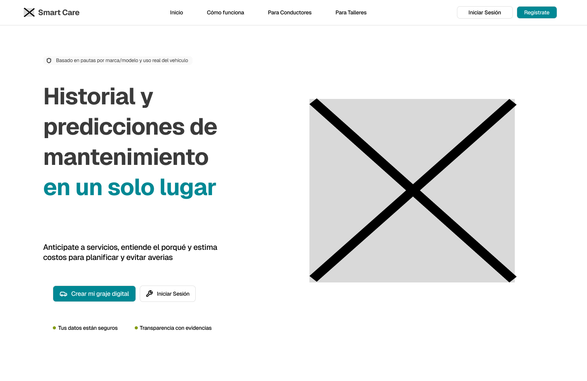
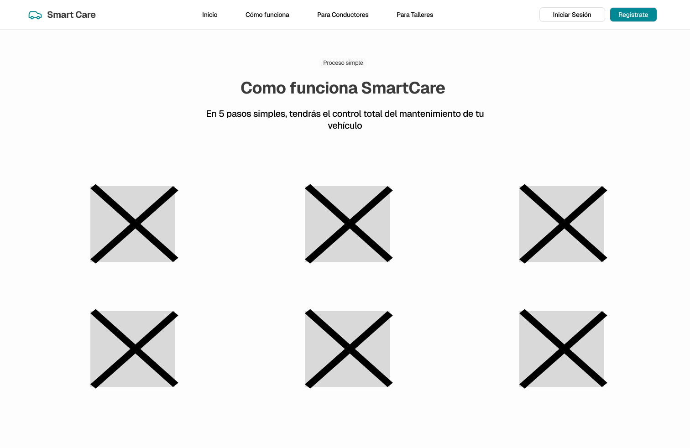
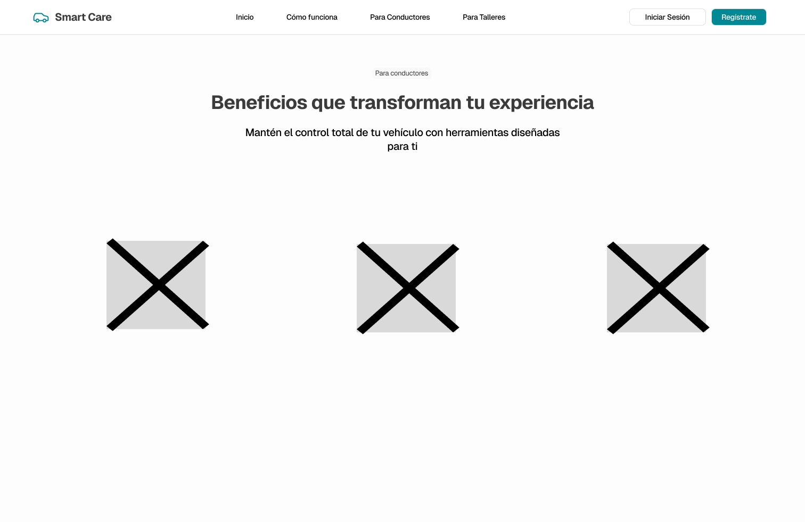
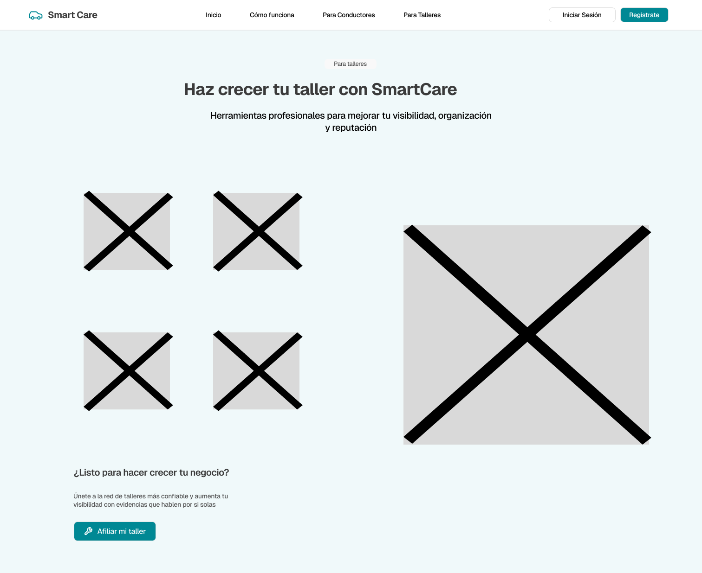
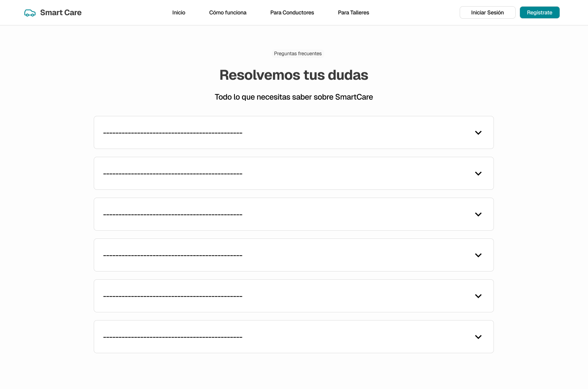
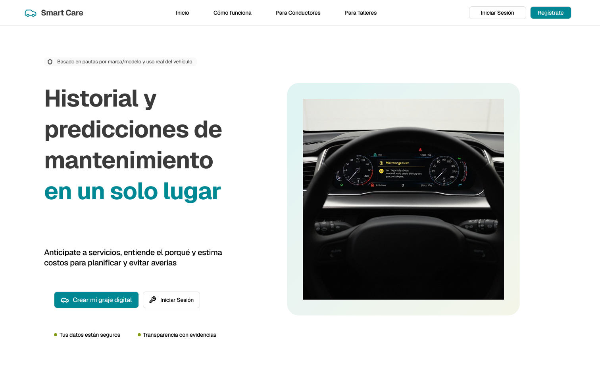
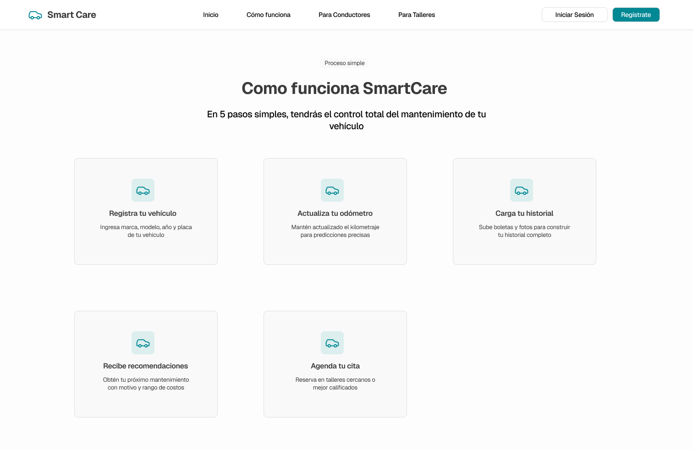
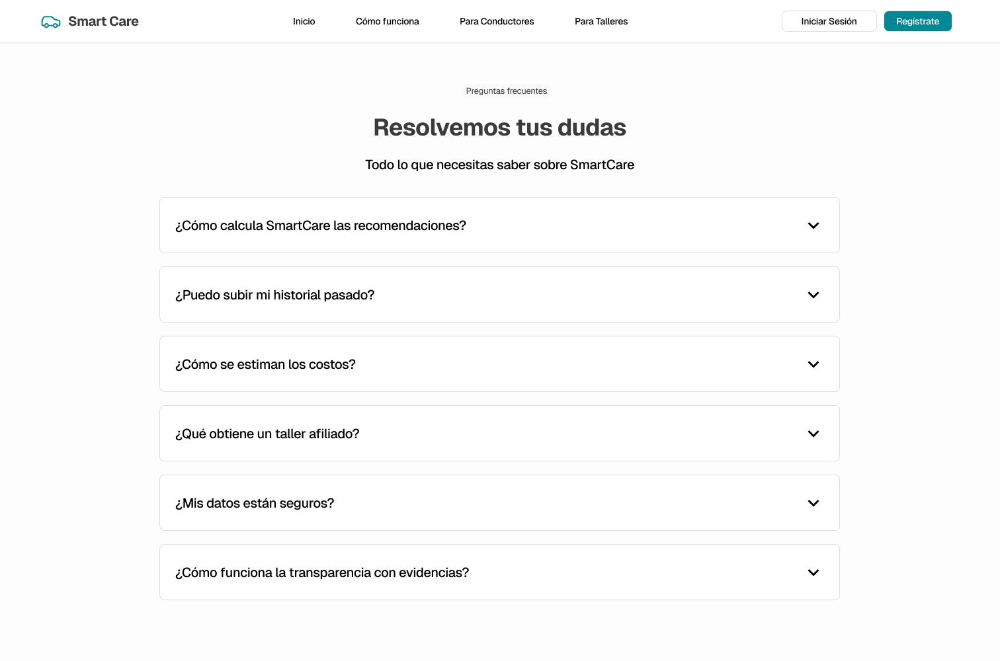

# Capítulo IV: Product Design

El *Product Design* será fundamental para nuestro trabajo, ya que nos permitirá crear soluciones centradas en el usuario que aborden de manera efectiva los desafíos identificados en el capítulo de requisitos. Con este enfoque, diseñaremos productos y servicios que sean **intuitivos, atractivos y alineados a las necesidades de nuestros usuarios principales: conductores y dueños/asesores de talleres**.  

Este capítulo guiará el proceso de diseño a través de lineamientos claros de estilo, arquitectura de información, navegación y diseño de interfaces. El objetivo es garantizar que la plataforma **SmartCare** no solo cumpla con su funcionalidad (historial digital de mantenimientos y predictor de servicios y costos), sino que también ofrezca una **experiencia de uso confiable, eficiente y atractiva**.  

De esta manera, se generará valor para nuestros clientes al ofrecerles **trazabilidad de sus vehículos, predicciones confiables y transparencia en la relación con talleres**, contribuyendo a los objetivos comerciales de adopción y escalabilidad de la plataforma.  

---

# 4.1. Style Guidelines

Un *Style Guideline* es un conjunto de reglas y normas que definen cómo se debe redactar, diseñar o presentar documentos, contenido web, software u otros trabajos creativos. A continuación, se detallan las especificaciones de los parámetros implementados en la estructura del proyecto **SmartCare**.

## 4.1.1. General Style Guidelines

### Branding
Para la creación de la identidad visual de **SmartCare**, se ha optado por un diseño **moderno y profesional** que transmita **confianza, transparencia e innovación** en el sector automotriz.  
El logotipo se compone de una **tipografía clara y sólida**, acompañada de un ícono que simboliza la **conexión entre conductor y taller**, así como la **trazabilidad digital de los mantenimientos**.  

**Paleta de colores seleccionada**:  
- **Azul principal**: confianza, seguridad y profesionalismo.  
- **Gris neutro**: equilibrio y soporte visual.  
- **Verde acento**: resalta éxito y predicciones positivas del sistema.  

Esta combinación comunica **credibilidad** hacia los conductores y atractivo comercial hacia los talleres afiliados.

### Tipografía
Se ha elegido una tipografía **Sans Serif** moderna y legible en dispositivos móviles y web.  
- **Títulos y encabezados**: peso **bold**, transmitiendo fuerza y claridad.  
- **Cuerpo de texto**: peso **regular**, con interlineado amplio que favorece la lectura.  

El estilo general busca mantener una comunicación **clara, directa y confiable** para los dos públicos objetivos.

### Iconografía
La iconografía se basa en un estilo **lineal, minimalista y reconocible**, representando conceptos clave como:  
- Vehículos y mantenimientos.  
- Talleres y herramientas.  
- Predicciones y costos.  
- Comunicación y notificaciones.  

Estos íconos facilitan la navegación, reforzando la **intuitividad** de la plataforma.

### Accesibilidad
El diseño de **SmartCare** cumple con criterios de accesibilidad:  
- **Contrastes de color** conformes a estándares **WCAG AA**.  
- **Botones y áreas táctiles** de al menos 44px para interacción cómoda.  
- **Etiquetas alternativas (alt text)** en imágenes e íconos.  
- Jerarquía clara en encabezados y estructura de información. 

## 4.2. Information Architecture

La arquitectura de información de **SmartCare** define cómo se organizará, nombrará y navegará el contenido dentro de la plataforma y su landing page. Este diseño busca garantizar que tanto **conductores** como **dueños/asesores de talleres** encuentren rápidamente la información y funcionalidades que necesitan.  

### 4.2.1. Organization Systems
La organización del sistema se estructura en base a los roles de usuario y las entidades principales del negocio:

- **Conductor**  
  - Mi Garaje (alta y gestión de vehículos).  
  - Historial digital de mantenimientos.  
  - Predictor de servicios y costos.  
  - Talleres cercanos o recomendados.  
  - Gestión de citas (reservar, reprogramar, cancelar).  
  - Perfil personal.  

- **Taller (jefe o asesor)**  
  - Perfil público del taller (datos, fotos, reseñas).  
  - Agenda de citas por día/semana.  
  - Órdenes de Trabajo (check-in, ítems, evidencias, cierre).  
  - Reputación (calificaciones y comentarios de clientes).  

- **Administrador**  
  - Gestión de catálogos (tipos de servicio, pautas de fabricante).  
  - Configuración de la arquitectura técnica (soporte al predictor y consistencia de datos).  

### 4.2.2. Labeling Systems
El sistema de etiquetado utiliza terminología clara y cercana para los usuarios, con énfasis en la acción y el beneficio inmediato. Ejemplos:

- **Conductores**:  
  - "Mi Garaje"  
  - "Historial de Servicios"  
  - "Próximo Servicio Sugerido"  
  - "Ver por qué"  
  - "Rango de Costo Estimado"  
  - "Talleres cerca de mí"  
  - "Reservar / Reprogramar / Cancelar Cita"  

- **Talleres**:  
  - "Agenda Semanal"  
  - "Órdenes de Trabajo"  
  - "Evidencias antes/después"  
  - "Cerrar OT"  
  - "Reputación del Taller"  

- **Landing Page**:  
  - "Cómo funciona"  
  - "Testimonios"  
  - "Beneficios para Talleres"  
  - "Crear mi garaje digital" (CTA conductor)  
  - "Afiliar mi taller" (CTA talleres)  

### 4.2.3. SEO Tags and Meta Tags
Para mejorar el posicionamiento de la landing y la aplicación en motores de búsqueda, se han definido etiquetas SEO y meta tags:

- **Meta title**: SmartCare — Historial digital y predictor de mantenimientos.  
- **Meta description**: Organiza el historial de tu vehículo, recibe predicciones de próximos servicios y costos, y agenda en talleres afiliados con SmartCare.  
- **Open Graph (OG)**:  
  - `og:title`: SmartCare — Tu historial y predictor automotriz digital.  
  - `og:description`: Predice, organiza y confía en tus mantenimientos con SmartCare.  
  - `og:image`: aqui colocar tal imagen (mockup hero LP).  
- **Twitter Card**: versión resumida con título, descripción y visual principal.  
- **JSON-LD (Schema.org)**: marcado para tipo `WebSite` y `Product`, con atributos de marca, beneficios y FAQs.  

### 4.2.4. Searching Systems
La búsqueda dentro de la plataforma se diseña para dar eficiencia en el acceso a la información:

- **Landing Page**:  
  - Búsqueda mínima, orientada a navegación rápida con anclas a secciones ("Cómo funciona", "Testimonios", "Beneficios para talleres").  

- **Web App**:  
  - Buscador de talleres con filtros por cercanía y calificación.  
  - Filtros en historial de mantenimientos (ej. “frenos”, “cambio de aceite”).  
  - Búsqueda por placa de vehículo.  

### 4.2.5. Navigation Systems
La navegación se plantea con menús claros, jerarquías simples y accesos directos a las funciones principales.  

- **Landing Page**:  
  - Inicio  
  - Cómo funciona  
  - Testimonios  
  - Beneficios para talleres  
  - FAQs  
  - CTA destacados: **Crear mi garaje digital** / **Afiliar mi taller**  

- **Aplicación web (Conductor)**:  
  - Mi Garaje  
  - Historial  
  - Predictor  
  - Talleres  
  - Citas  
  - Perfil  

- **Aplicación web (Taller)**:  
  - Agenda  
  - Órdenes de Trabajo  
  - Reputación  
  - Perfil del Taller  

**Patrones de navegación implementados**:  
- Barra de navegación fija en la parte superior.  
- Breadcrumbs en vistas profundas (ejemplo: dentro de una OT).  
- Accesos directos (FAB) para acciones frecuentes como "Añadir lectura de odómetro".  

## 4.3. Landing Page UI Design

El diseño de la **Landing Page** de SmartCare tiene como objetivo principal transmitir la propuesta de valor en menos de 30 segundos y motivar al visitante a registrarse como conductor o afiliar su taller. Para ello, se han creado prototipos visuales que muestran la estructura, distribución y estilo de la página.

### 4.3.1. Landing Page Wireframe

En esta sección se presentan los wireframes de la landing page, donde se define la disposición de los elementos principales y la jerarquía de información.

 

### 4.3.2. Landing Page Mock-up

Aquí se muestran los mock-ups de alta fidelidad diseñados en Figma, donde se aplican la paleta de colores, tipografía e iconografía definidos en las guías de estilo.

