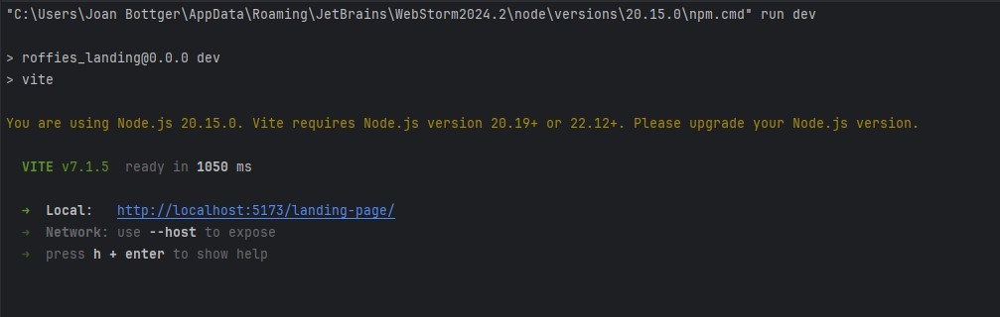
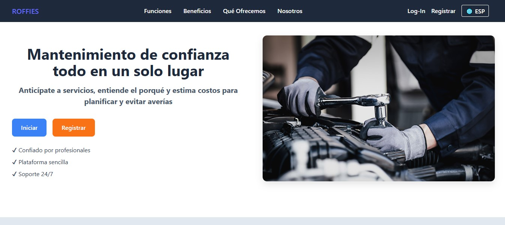
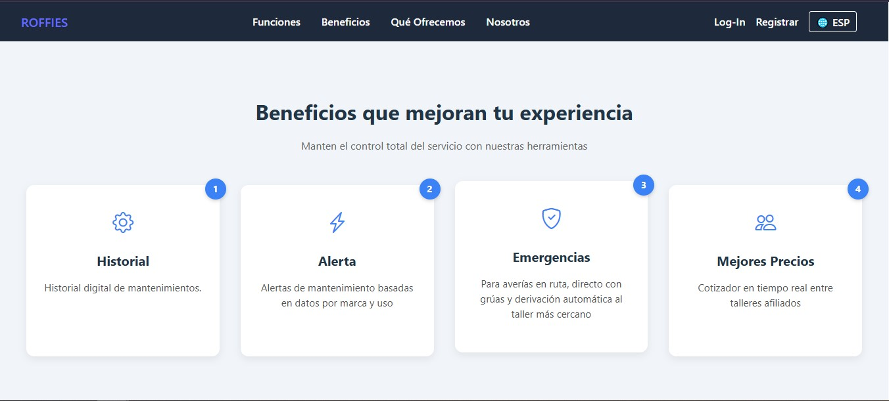
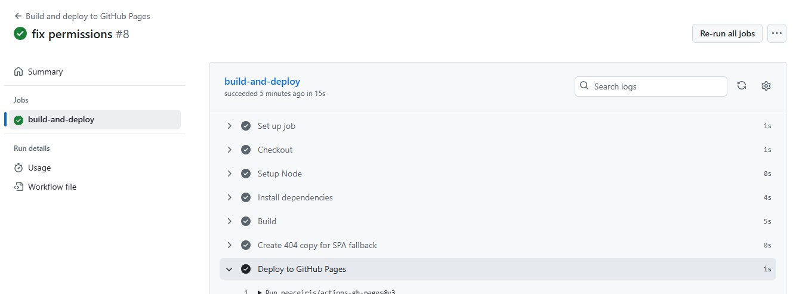

# 5.1. Software Configuration Management

A continuación, se presentan las decisiones y convenciones que permitirán mantener la consistencia durante el ciclo de vida.

## 5.1.1. Software Development Environment Configuration
En esta sección se incluyen los links de las aplicaciones y productos de software utilizados durante el ciclo del proyecto **SmartCare**, en los programas que se usaron para colaborar en el desarrollo del producto digital. Para ello se clasifican en las siguientes secciones:

## 5.1.2. Source Code Management

### Project Management
Es la disciplina encargada de la gestión de los proyectos, la cual tiene como objetivo principal mejorar los procesos y su entorno para alcanzar los resultados esperados.  
En el ciclo digital del proyecto se implementará un producto software con un modelo SaaS que se ejecutará a través de un navegador, sin embargo, no se creará una versión de aplicación móvil.

### Requirements Management
Es el proceso de garantizar que una organización documente, verifique y satisfaga las necesidades y expectativas de sus clientes con las partes interesadas internas o externas.  
- **Pivotal Tracker**: Se usó esta herramienta porque organiza bien las user stories y ayuda a mantener el avance del proyecto claro y ordenado.  
  [https://www.pivotaltracker.com/](https://www.pivotaltracker.com/)

### Product UX/UI Design
Estas herramientas permiten desarrollar el modelo de nuestro producto de manera digital y de forma parte de la vida del consumidor. En este caso se realizó un modelo de sitio web.  
- **Uxpressia**: Elaboración de User Persona, Empathy Maps, Journey Maps e Impact Maps.  
  [https://uxpressia.com/](https://uxpressia.com/)  
- **Miro**: Para los As-Is y To-Be Scenario Maps.  
  [https://miro.com/](https://miro.com/)  
- **Figma**: Elaboración de Wireframes, Mock-ups y Prototypes de nuestra Landing Page y Web Application.  
  [https://www.figma.com/](https://www.figma.com/)  
- **Lucidchart**: Elaboración de Wireflows y User Flows.  
  [https://www.lucidchart.com/](https://www.lucidchart.com/)

### Software Development
- **GitHub**: Plataforma utilizada para control de versiones, colaboración y almacenamiento del código fuente del proyecto. Se aplicó GitFlow para mantener un flujo de trabajo ordenado.  
  [https://github.com/](https://github.com/)  
- **HTML**: Estructura del contenido de la Landing Page y vistas principales.  
  [https://developer.mozilla.org/es/docs/Web/HTML](https://developer.mozilla.org/es/docs/Web/HTML)  
- **CSS**: Diseño visual del sitio, respetando Material Design y estilos personalizados.  
  [https://developer.mozilla.org/es/docs/Web/CSS](https://developer.mozilla.org/es/docs/Web/CSS)  
- **JavaScript**: Implementación de lógica del lado del cliente, validaciones, interacciones y consumo de servicios externos.  
  [https://developer.mozilla.org/es/docs/Web/JavaScript](https://developer.mozilla.org/es/docs/Web/JavaScript)

### Software Testing
- **Lenguaje Gherkins**: Para definir criterios de aceptación y escenarios de prueba en lenguaje natural, facilitando la comprensión de desarrolladores y usuarios.  
  [https://profile.es/blog/que-es-gherkin/](https://profile.es/blog/que-es-gherkin/)

### Software Documentation
- **LucidChart**: Diagramas UML y de Base de Datos.  
  [https://www.lucidchart.com/](https://www.lucidchart.com/)  
- **Structurizr**: Documentación de arquitectura bajo modelo C4 (Context, Container, Component, Code).  
  [https://structurizr.com/](https://structurizr.com/)

## 5.1.3. Source Code Style Guide & Conventions
Se adoptaron guías de estilo estándar en inglés para cada lenguaje empleado:  
- HTML/CSS: Google HTML/CSS Style Guide  
- JavaScript: Google JavaScript Style Guide, MDN Guidelines  

Esto asegura legibilidad, coherencia y facilidad de mantenimiento en todo el código del proyecto.

## 5.1.4. Software Deployment Configuration
La gestión del código fuente del proyecto **SmartCare** se realizó utilizando GitHub. Para la publicación y despliegue de la Landing Page, se empleó GitHub Pages, que permite una visualización directa desde el repositorio principal.

Para el desarrollo y despliegue de la Landing Page de **SmartCare** se han utilizado las siguientes herramientas:

- **HTML**: Lenguaje de marcado para estructurar el contenido visual y semántico de la Landing Page (encabezados, párrafos, botones, formularios, etc.).  
- **CSS**: Lenguaje de estilos para dar formato, color, distribución y diseño gráfico, logrando una interfaz atractiva e interactiva.  
- **JavaScript**: Añade interactividad y dinamismo a los componentes de la Landing Page, como validaciones en formularios, navegación fluida y respuestas a eventos del usuario.

https://roffies.github.io/landing-page/

## 5.2 Landing Page, Services & Applications Implementation

### 5.2.1 Sprint 1
Durante este período, nos enfocamos en la implementación de las características y funcionalidades prioritarias identificadas en la planificación inicial. Esto implica traducir los requisitos y especificaciones en código funcional, desarrollando las bases de nuestro producto de manera iterativa.

#### 5.2.1.1 Sprint Planning
En esta sección, se presentará el sprint #1 con la versión inicial del trabajo para la entrega del proyecto, detallando la organización, distribución y evidencia de resultados de la landing page.

| Sprint 1  | Date  | Time  | Location  | Prepared By  | Attendees  |
|---|---|---|---|---|---|
| 1  | 12/9/2025  | 21:00  | Reunión mediante Google Meet  | Luis Sebastián Rubio  | Johan Bottger, Pierina Carbajal, Piero Sanchez, Rubens Bendezu |
| Sprint 1 Goal  | Sprint 1 Velocity  | Sum of Story Points  | Aspectos Técnicos  |
|---|---|---|
| Elaborar y diseñar el landing page y documentación inicial para la aplicación ROFFIES | 12  | 12  | HTML5, CSS3, JS, Figma, Vue, Primevue  |

#### 5.2.1.2. Aspect Leaders and Collaborators

#### 5.2.1.3 Sprint Backlog 1
Durante el primer sprint, el equipo se centró en desarrollar una landing page que fuera tanto atractiva como funcional, organizando y distribuyendo tareas en el tablero de Sprint de acuerdo con las habilidades de cada integrante.

####### HU1 Landing Page - Como usuario, quiero una página funcional y atractiva como portada a la aplicación web.
Tsk001 NavBar
Tsk002 Secciones
Tsk003 Login
Tsk004 Signup

#### 5.2.1.4 Development Evidence for Sprint Review
En esta sección se explica y presenta los avances en implementación con relación a los productos de la solución según el alcance del primer Sprint: Landing Page.

A continuación, se presentan los commits más importantes para el Reporte, los cuales muestran el ciclo de vida del proyecto, y toda la información que se usó para el desarrollo del proyecto.

| Repository | Branch | Commit ID | Message | Body | Commit Date  |
|---|---|---|---|---|---|
| Roffies | 12/9/2025  | 21:00  | Reunión mediante Google Meet  |   |   |

#### 5.2.1.5 Testing Suite Evidence for Sprint Review
No aplica a primer sprint y desarrollo de Landing Page.

#### 5.2.1.6 Execution Evidence for Sprint Review
Se incluyen capturas detalladas de la ejecución de la Landing Page de la aplicación como evidencia.
La Landing Page es compuesta por varias secciones que se presentan en las capturas a continuación.

#### 5.2.1. Services Documentation Evidence for Sprint Review
No aplica a primer sprint y desarrollo de Landing Page.

#### 5.2.1.7. Software Deployment Evidence for Sprint Review
Se incluye la evidencia de despliegue del Landing Page en la plataforma Github Pages.

#### 5.2.1.8 Team Collaboration Insights during Sprint
Durante el transcurso de este sprint, todos los miembros participaron de forma activa y constante en la creación de las tareas asignadas. A continuación todos los analíticos que nos proporciona Github, en su apartado de Insights, sobre la colaboración del
equipo durante el Sprint 1:

